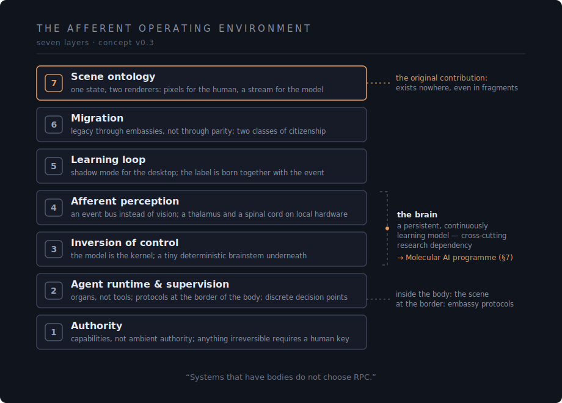

# The Afferent Operating Environment

**Concept · v0.3 · July 2026**

An operating environment in which AI is not an application running on
the system — the system is the AI's body. Interfaces are organs, the
model is the brain, the human is an observer with a standing ability
to intervene, and the screen is not an interface *to* the system but
a projection *from* it.

> GUI = a data stream of every molecule of state.

> By day, the organism fits in a laptop; by night, its dreams go to
> orbit — and come back weighing a few megabytes.

## Documents

- **[English edition](./afferent-operating-environment.md)** — the
  public version.
- **[Русский оригинал](./afferent-operating-environment.ru.md)** —
  the source text; in case of divergence, the original governs.

## The seven layers

1. **Authority** — capabilities instead of ambient authority; anything
   irreversible requires a human key.
2. **Agent runtime & supervision** — applications are organs, not
   tools; protocols belong at the boundary of the body; supervision as
   discrete decision points, not continuous watching.
3. **Inversion of control** — the model is the kernel; a tiny
   deterministic "brainstem" underneath; the system as a JIT compiler
   for intent.
4. **Afferent perception** — an event bus instead of vision:
   proprioception, a thalamus, and a spinal cord on local hardware.
5. **The learning loop** — shadow mode for the desktop; the label is
   born together with the event.
6. **Migration** — legacy through embassies, not through parity; two
   classes of citizenship.
7. **Scene ontology** — one scene of state, two renderers: pixels for
   the human, a stream for the model. *Systems that have bodies do
   not choose RPC.*

The maturity map inside the document is honest about what already
ships, what exists in fragments, and what exists nowhere: Layer 7 is
the original contribution, and the cross-cutting dependency — a
persistent, continuously learning model — points to the Molecular AI
research programme (§7 of the concept).

## Status

A concept document, not an implementation. Version 0.3. The English
edition is a translation of the Russian original.

## License & authorship

Licensed under [CC BY 4.0](./LICENSE). The document is a product of
dialogic co-authorship with asymmetric responsibility: the seven
formulations that constitute the concept are the author's; the
development, critique, and landscape mapping emerged in dialogue with
an AI assistant (Claude, Anthropic). Responsibility for the content
rests with the human author.
